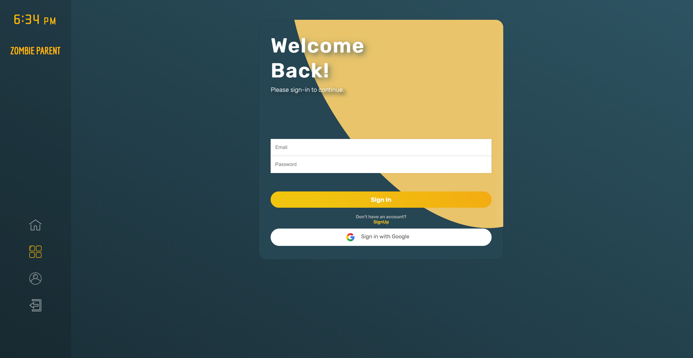
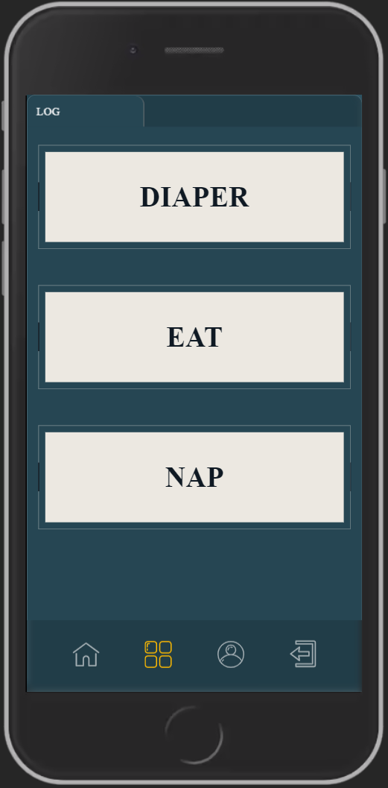
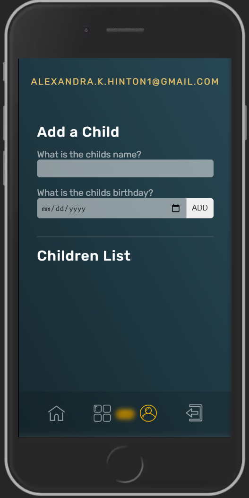
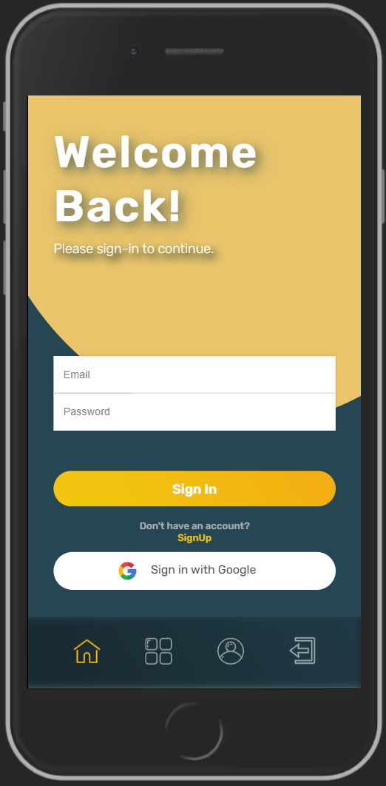

# Zombie Parent

## Description

Zombie Parent is an activity tracker under development. The goal is to give sleep-deprived parents and caregivers an easy way to log child care events, discover and view patterns, and establish rhythms with their child. The app will be built with MongoDB, Express, React, and Node.js.

## Table of Contents

* [User-Story](#User-Story)
* [Features](#Features)
* [Links](#Links)
* [Workflow](#Workflow)
* [Technology](#Technology)
* [Reference](#Reference)
* [Contributors](#Contributors)
* [Questions](#Questions)
* [License](#License)

## User-Story

AS A fatigued parent or child caretaker
I WANT a simple tracking tool to help me find and reinforce infant bio-rhythms 
SO THAT I can give child care that encourages consistent and predictable cycles of sleeping, feeding, and waste elimination.

## Features

Working Features: 

* Users can:
    
    * [x] Login/Sign up with Google account
    * [x] Login/Sign up with email
    * [x] Log when the child uses the diaper
    * [x] Log when the child is fed
    * [x] Log when the child sleeps
    * [x] Create a new child with name and birthday
    * [x] Use either mobile or desktop version
    * [x] See their current time on the desktop version
    * [x] View on the last 24 hours of the logged actions on the homepage
    * [x] View logs of the current active child
    * [x] Switch between active child on the Profile Page

Under Development:

* Display additional data on the homepage for future data
* Switch between different children on the homepage
* Long term data display to view patterns
* Delete a current child
* Update a new child
* Upload images for users and children
* Editing usernames
* REACT NATIVE

## Links

* Project Repo: [Repository](https://github.com/jeishu/zombie-parent)
* Deployed Application: [Zombie Parent](https://zombie-parent.herokuapp.com/)

## Workflow

## Technology

| Language | Dependencies |  |
| --- | --- | --- |
| Javascript | Axios | moment |
| HTML | Firebase | Concurrently |
| CSS | express | if-env |
| SASS | Framer-motion | Mongoose |
| React | Style-components | nodemon |
| | react-router-dom | react-moment |
| | Sass-loader | Material-UI-Core |
| | Material-UI-Lab | 

## Reference

| Name | Description |
| --- | --- | 
| [Flaticon](https://www.flaticon.com/authors/freepik) | All Icons were uses from this website from the same author, Freepik. |

## Contributors

Developer Roles

* Alexandra Hinton
    * Firebase
    * Google Authentication
* Dan Aument
    * Backend Developer
        * Database
        * Mongoose Setup
    * Frontend Developer
* Darren Garcia
    * UI/UX Design
* Jeremy Zhu
    * Frontend Developer
    * UI/UX Design
    * Mobile Design
    * Heroku and Github Repo
* Joey Sisk
    * Frontend Developer
    * React Mechanic

## Questions
If you have any question about the application, don't hesitate to contact us from our Github Profile:

[Alexandra Hinton](https://github.com/a-hinton)

[Dan Aument](https://github.com/danaument)

[Darren Garcia](https://github.com/notdarrengarcia)

[Jeremy Zhu](https://github.com/jeishu)

[Joey Sisk](https://github.com/Joey-Sisk)

## License

MIT © 2021 Pteam Ptoo6